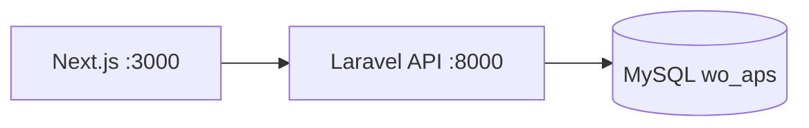

# Architecture — Workshop Work Order System

## Overview

Monorepo dengan pemisahan frontend (Next.js) dan backend API (Laravel).

## Domain Model

- **WorkOrder** — `main` (component/unit/other) atau `sub` (rebuild/fabrication/support) dengan `parent_id`
- **MechanicActivity** — jam kerja per mekanik, productive/non-productive/mechanic_skill
- **PartsRequest** — permintaan part + items, alur logistic
- **WorkOrderStatusLog** — audit trail perubahan status

## Workflow Status (WO)

`draft` → `pending_supervisor` → `approved` → `in_execution` → `qc_pending` → `qc_approved` → `closed`

## Auto Work Details

`WorkOrder::refreshWorkDetails()` mengagregasi aktivitas approved + parts approved/taken ke field `work_details`, `actual_hours`, `material_cost`.

## API Routes

Lihat `backend/routes/api.php` — semua protected dengan `auth:sanctum`.

## Roles & Permissions

Permission didefinisikan di `backend/app/Support/Permission.php` dan disinkronkan ke frontend `src/lib/permissions.ts`.

| Role | Permission utama |
|------|----------------|
| **planner** | Buat/edit/submit WO, lihat semua aktivitas, buat parts, reports |
| **supervisor** | Approve WO/aktivitas/parts, inspection, reports (tanpa buat WO) |
| **mechanic** | Input aktivitas sendiri, buat/submit parts, lihat WO (read-only) |
| **logistic** | Proses parts approved (`logistic_check` / `taken`), lihat WO |
| **admin** | Semua permission |

API routes dilindungi middleware `permission:nama.permission`. Response login/me menyertakan array `permissions` untuk UI guard.
